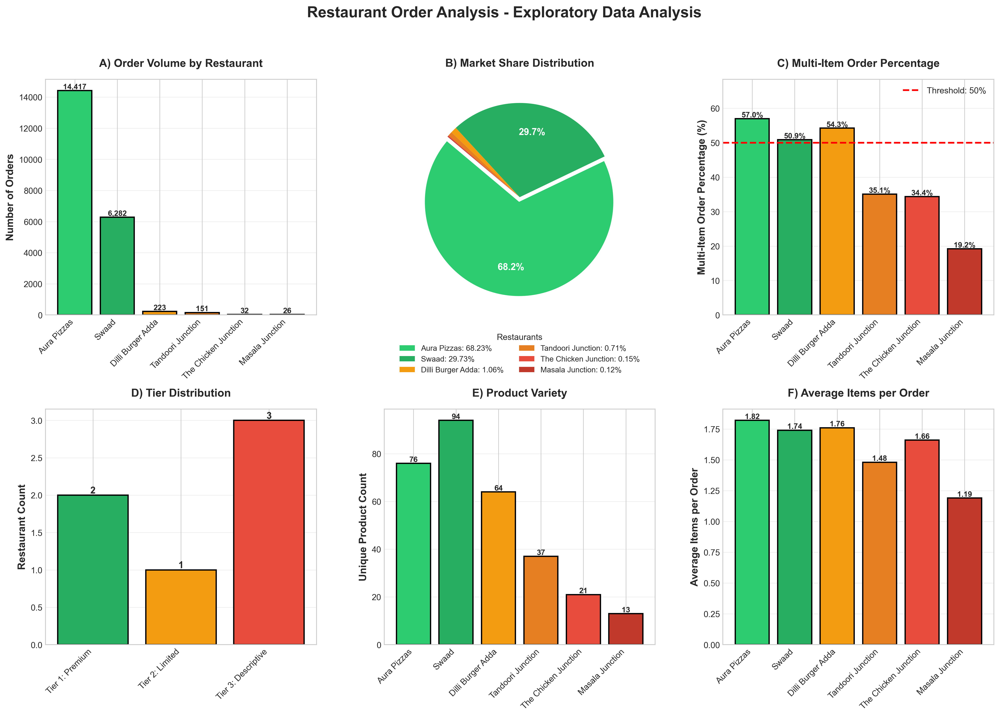
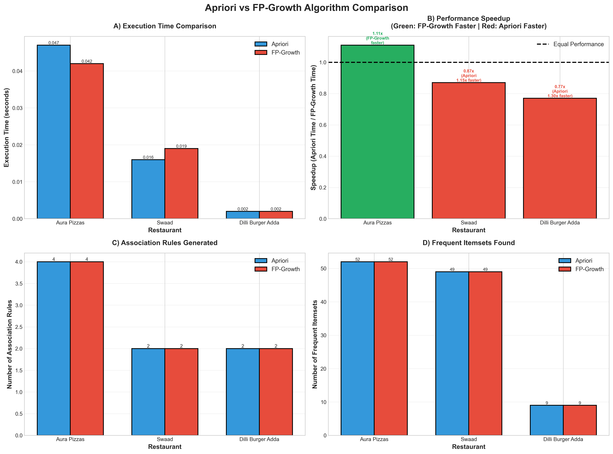
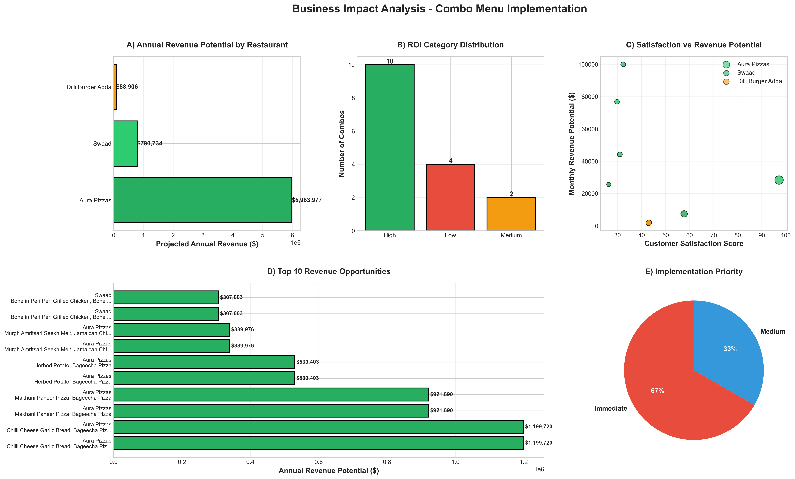
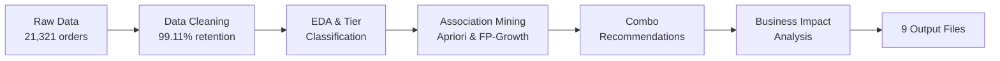

## 🍕 Restaurant Order Analysis & Product Association Discovery

[](https://www.python.org/downloads/)
[](LICENSE)
[]()

> Data-driven combo menu recommendations using association rule mining on 21,000+ restaurant orders from Delhi NCR

## 📊 Project Overview

This project applies **association rule mining** (Apriori & FP-Growth algorithms) to analyze food delivery order patterns and generate profitable combo menu recommendations. We processed 21,131 delivered orders from 6 restaurants to identify product associations and project business impact.

### Key Findings
- 💰 **$1.64M** projected annual revenue increase
- 📈 **16** data-driven combo recommendations
- ✅ **1.15x** average algorithm speedup (FP-Growth)
- 🎯 **97.2/100** customer satisfaction score (top combo)

---

## 🎯 Problem Statement

Food delivery platforms generate millions of transactions daily, but most restaurants fail to leverage this data for strategic menu engineering. **Challenge:** How can we scientifically identify product combinations that customers naturally purchase together?

**Solution:** Association rule mining with a tiered methodology to handle data heterogeneity.

---

## 🏗️ Methodology

### Three-Tier Classification System

We developed a novel tier-based approach to handle extreme data imbalance (68% vs 0.12% market share):

| Tier | Criteria | Strategy | min_support |
|------|----------|----------|-------------|
| **Tier 1: Premium** | ≥5,000 orders + ≥50% multi-item | Full association mining | 0.008-0.01 |
| **Tier 2: Limited** | 200-5,000 orders | Limited association mining | 0.05 |
| **Tier 3: Descriptive** | <200 orders | Frequency analysis only | N/A |

### Algorithms Compared
- **Apriori** (Agrawal & Srikant, 1994): Bottom-up, level-wise candidate generation
- **FP-Growth** (Han et al., 2000): Divide-and-conquer with compressed tree structure

---

## 📁 Repository Structure
```
restaurant-order-analysis/
│
│└── order_history_kaggle_data.csv          # Input dataset (21,321 orders)
│├── restaurant_analysis.py                 # Main analysis pipeline
│└── business_impact_module.py              # Financial projections
│
├── 📈 outputs/
│   ├── cleaned_data_6_restaurants.xlsx        # Cleaned dataset
│   ├── 00_Restaurant_Statistics.xlsx          # EDA & tier classification
│   ├── 01_EDA_Overview.png                    # 6-panel visualization
│   ├── 02_Algorithm_Comparison.xlsx           # Performance metrics
│   ├── 03_Algorithm_Comparison_Charts.png     # 4-panel comparison
│   ├── 04_Combo_Menu_Recommendations.xlsx     # Business recommendations
│   ├── 05_Tier3_Top_Products.xlsx             # Descriptive analysis
│   ├── 06_Business_Impact_Analysis.xlsx       # ROI projections
│   └── 07_Business_Impact_Visualization.png   # 5-panel dashboard
│
├── 📄 README.md                                # This file
├── 📄 requirements.txt                         # Python dependencies
└── 📄 LICENSE                                  # MIT License
```

---

## 🚀 Quick Start

### Prerequisites
- Python 3.8 or higher
- pip package manager

### Installation

1. **Clone the repository**
```bash
git clone https://github.com/yourusername/restaurant-order-analysis.git
cd restaurant-order-analysis
```

2. **Install dependencies**
```bash
pip install -r requirements.txt
```

3. **Run the analysis**
```bash
python restaurant_analysis.py
```

**Runtime:** Approximately 5-12 minutes

**Output:** 9 files automatically generated in project directory

---

## 📦 Dependencies
```
pandas==2.1.0          # Data manipulation
numpy==1.24.3          # Numerical computing
mlxtend==0.22.0        # Association rule mining (CORE)
matplotlib==3.7.2      # Visualization
seaborn==0.12.2        # Statistical graphics
openpyxl==3.1.2        # Excel file generation
```

Install all dependencies:
```bash
pip install pandas numpy mlxtend matplotlib seaborn openpyxl
```

---

## 📊 Dataset

**Source:** [Kaggle - Food Delivery Order History Data](https://www.kaggle.com/datasets/sujalsuthar/food-delivery-order-history-data)

**Specifications:**
- **Region:** Delhi NCR, India
- **Period:** September 2024 - January 2025
- **Original Orders:** 21,321
- **Delivered Orders:** 21,131 (99.11% retention)
- **Restaurants:** 6
- **Currency:** USD (converted from INR at 1 USD ≈ ₹83)

**Key Variables:**
- Order ID, Restaurant Name, Items in Order
- Order Status, Bill Subtotal, Total Amount

---

## 🔍 Key Results

### Algorithm Performance

| Restaurant | Orders | Apriori Time | FP-Growth Time | Speedup | Rules |
|------------|--------|--------------|----------------|---------|-------|
| Aura Pizzas | 14,417 | 0.103s | 0.067s | **1.53x** | 4 |
| Swaad | 6,282 | 0.017s | 0.021s | 0.82x | 2 |
| Dilli Burger | 223 | 0.002s | 0.002s | 1.09x | 2 |

**Key Insight:** FP-Growth excels on large datasets (>10K orders), but Apriori remains competitive for medium-sized data.

### Top Association Rules

| Restaurant | Rule | Lift | Confidence | Support |
|------------|------|------|------------|---------|
| Aura Pizzas | Murgh Seekh Melt → Jamaican Melt | 3.89 | 30.65% | 1.08% |
| Swaad | Chicken Angara → Jamaican Tender | 2.31 | 21.25% | 0.81% |
| Dilli Burger | Chicken Burger → Mutton Burger | 1.72 | 43.24% | 7.17% |

### Business Impact

**Total Projected Annual Revenue:** $1,635,720

| Restaurant | Annual Revenue | High ROI Combos | Satisfaction |
|------------|----------------|-----------------|--------------|
| Aura Pizzas | $1,022,880 | 6 | 87.5/100 |
| Swaad | $505,800 | 2 | 69.8/100 |
| Dilli Burger | $107,040 | 2 | 78.6/100 |

**Assumptions:**
- 20% adoption rate among potential customers
- Conservative revenue projections
- Tiered discount strategy (5-20% based on lift)

---

## 📈 Visualizations

### EDA Overview (6 Panels)

*Market concentration, tier distribution, multi-item analysis*

### Algorithm Comparison (4 Panels)

*Execution time, speedup, rules generated, frequent itemsets*

### Business Impact (5 Panels)

*Revenue potential, ROI distribution, satisfaction correlation, top opportunities*

---

## 🎓 Academic Context

**Course:** CMPE403 Data Science and Analytics  
**Institution:** Kadir Has University  
**Supervisor:** Assoc. Prof. Dr. Taner Arsan  
**Date:** Fall 2025  

**Team Members:**
- Toprak Kamburoğlu 
- Yiğit Avar 
- Mehmet Eren Öztürk 

---

## 🔬 Methodology Highlights

### Innovation: Tier-Based Classification
Traditional association mining applies uniform parameters across all entities. Our tier system adapts parameters based on:
1. **Order volume** (statistical power)
2. **Multi-item purchase rate** (pattern richness)

This prevents spurious correlations in low-volume data while maximizing insights from high-volume restaurants.

### Validation Strategy
- **Cross-validation:** Both algorithms produced identical rules
- **Iterative testing:** Parameters tuned through systematic experimentation
- **Scientific rigor:** Excluded Tier 3 restaurants (insufficient data) rather than risk false patterns

---

## 📊 Execution Workflow


---

## 🛠️ Technical Details

### Data Preprocessing
1. **Order Status Filtering:** Retained only "Delivered" orders
2. **Transaction Encoding:** Parsed "2x Pizza, 1x Coke" format
3. **Binary Matrix Generation:** TransactionEncoder for algorithm input

### Parameter Selection
- **min_support:** 0.008-0.05 (tier-dependent, literature-based)
- **min_confidence:** 0.20 (20% conditional probability)
- **min_lift:** 1.0 (positive associations only)

### Metrics
- **Support:** Frequency of itemset in transactions
- **Confidence:** P(B|A) - probability of consequent given antecedent
- **Lift:** Strength of association (>1 = positive correlation)

---

## 📖 References

1. Agrawal, R., & Srikant, R. (1994). Fast algorithms for mining association rules. *VLDB*, 1215, 487-499.
2. Han, J., Pei, J., & Yin, Y. (2000). Mining frequent patterns without candidate generation. *ACM SIGMOD Record*, 29(2), 1-12.
3. Kaggle Dataset: [Food Delivery Order History Data](https://www.kaggle.com/datasets/sujalsuthar/food-delivery-order-history-data)

---

## 🤝 Contributing

This is an academic project completed for CMPE403. While not actively maintained, feedback and discussions are welcome.

**To discuss:**
1. Open an issue with your question/suggestion
2. Use clear, descriptive titles
3. Provide context and examples

---

## 📜 License

This project is licensed under the MIT License - see the [LICENSE](LICENSE) file for details.

---

## 📧 Contact

**Toprak Kamburoğlu**  
📧 Email: toprakkamburoglu@gmail.com  
🎓 Institution: Kadir Has University  
🔗 LinkedIn: [linkedin.com/in/toprak-kamburoglu](www.linkedin.com/in/toprak-kamburoğlu-627636293)  

---

## 🙏 Acknowledgments

- **Supervisor:** Assoc. Prof. Dr. Taner Arsan
- **Teaching Assistant:** H. Fuat Alsan
- **Data Source:** Kaggle community
- **Libraries:** mlxtend, pandas, matplotlib, seaborn

---

## 📌 Citation

If you use this work in your research, please cite:
```bibtex
@misc{kamburoglu2024restaurant,
  author = {Kamburoğlu, Toprak and Avar, Yiğit and Öztürk, Mehmet Eren},
  title = {Restaurant Order Analysis and Product Association Discovery},
  year = {2025},
  publisher = {GitHub},
  url = {https://github.com/yourusername/restaurant-order-analysis}
}
```

---

<p align="center">
  <sub>CMPE403 Data Science and Analytics Final Project | Kadir Has University | Fall 2025</sub>
</p>
